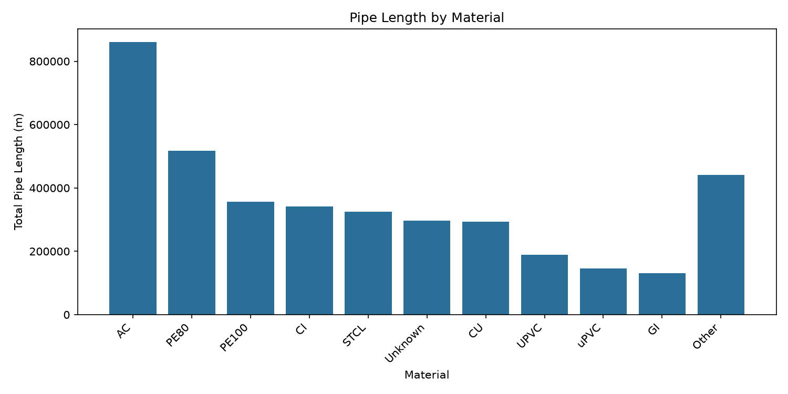
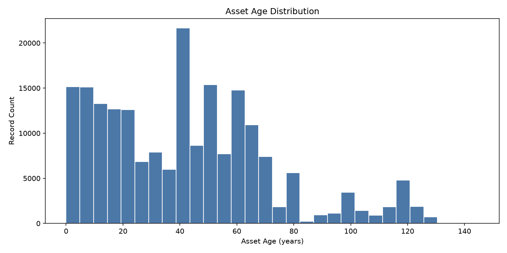
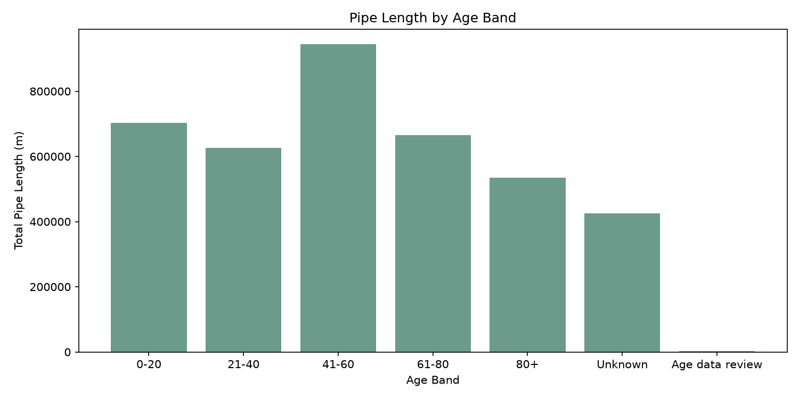
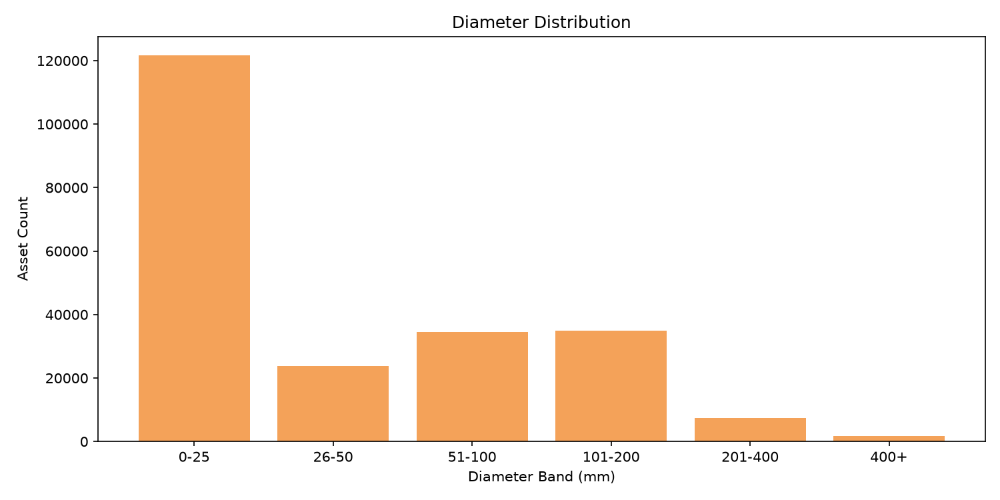
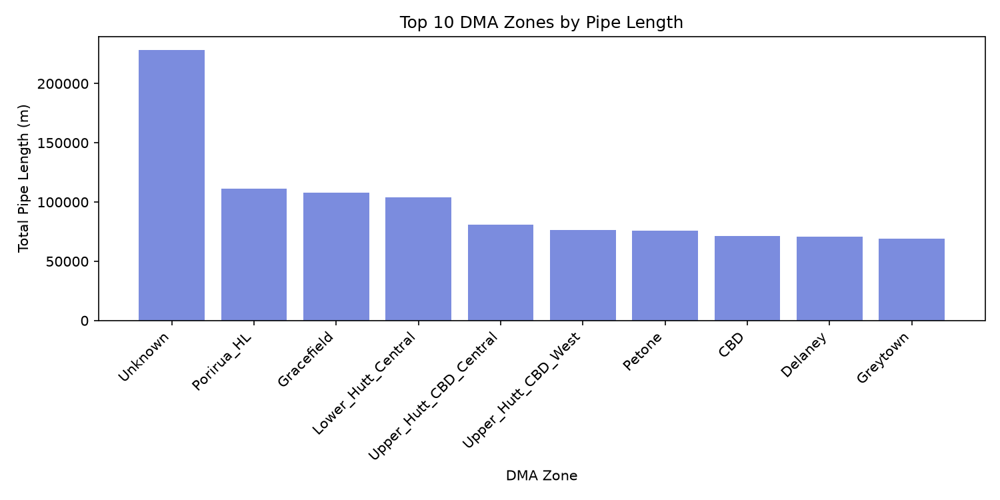
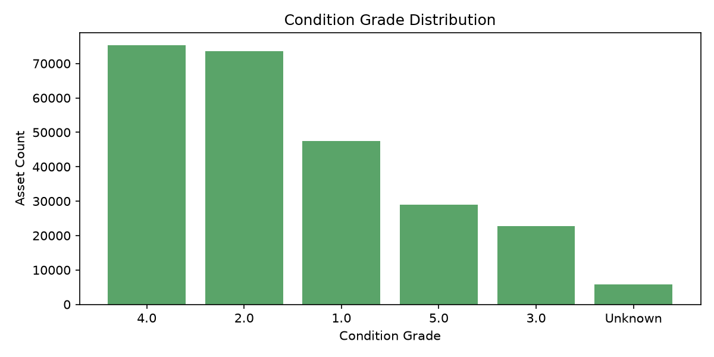
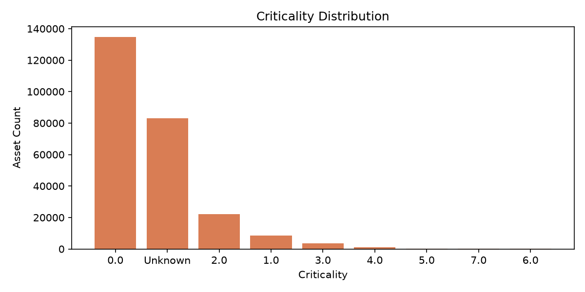
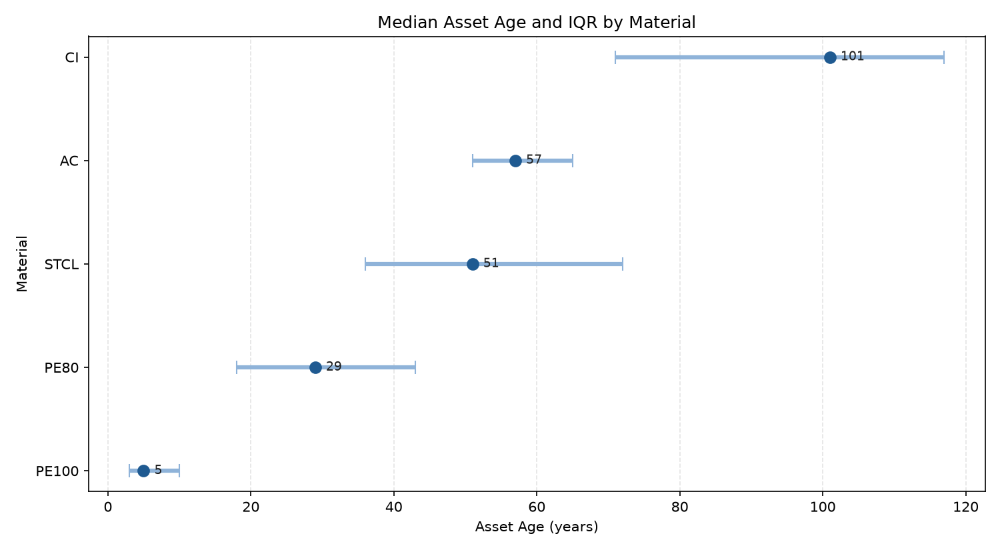
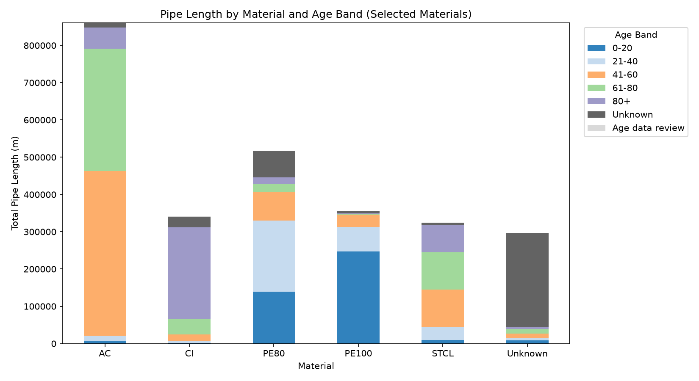

# Wellington Water Pipe Asset Portfolio and Renewal Priority Screening Report

## 1. Project Background

Water pipe networks are long-lived infrastructure assets, and renewal decisions often need to balance asset age, condition, criticality, data quality, and available investment. This independent portfolio project uses publicly available Wellington Water Open Data to review Wellington regional water pipe assets and produce a portfolio-level reporting and renewal review screening output.

The analysis is intended to support asset planning conversations, data quality review, and further investigation by providing a transparent and practical summary of the available asset portfolio. It is not a failure prediction model, and it is not a final engineering decision tool.

## 2. Data Used

This analysis uses a publicly available Wellington Water Open Data dataset covering Wellington regional water pipe assets.

| Item | Details |
| --------------- | -------------------------------------------------------------------------------------------------- |
| Dataset | Regional Water Pipes |
| Source | Wellington Water Open Data |
| Dataset URL | [https://data-wellingtonwater.opendata.arcgis.com/datasets/d264f8d5c8bb4c519412b7ed86d5bcb8_0/about](https://data-wellingtonwater.opendata.arcgis.com/datasets/d264f8d5c8bb4c519412b7ed86d5bcb8_0/about) |
| Local file used | Regional_Water_Pipes_2925950293390148246.csv |
| Records | 253,690 |
| Columns | 35 |

The dataset review focused on structure and field availability. The key analytical fields used in this analysis were mapped to the dataset columns that best support portfolio-level assessment.

The dataset contains Wellington regional water pipe asset attributes such as asset ID, operational status, material, diameter, length, installation date, DMA zone, condition grade, and criticality.

Key field mapping:

- Unique asset identifier: `Asset ID`
- Operational status: `Operational Status`
- System type: `System Type`
- Material: `Material`
- Diameter: `Diameter_mm`
- Length: `Length_m`
- Install date: `Date Installed`
- Decommission date: `Date Decommissioned`
- Operational zone: `DMA Zone`
- Condition: `Condition Grade`
- Criticality: `Criticality`

`Asset ID` is used as the main identifier instead of `OBJECTID`, `Historic ID`, or `Key`. `Date Installed` is the primary field used for age estimation, while `Acquisition Date` is retained as a reference field only. `Condition Grade` and `Criticality` were assessed for their suitability in the screening approach.

## 3. Data Quality Snapshot

The data quality review assessed the confirmed analytical fields used for later screening: `Asset ID`, `Operational Status`, `System Type`, `Material`, `Diameter_mm`, `Length_m`, `Date Installed`, `Date Decommissioned`, `DMA Zone`, `Condition Grade`, and `Criticality`.

The review focused on three core quality checks:

- Completeness of the confirmed analytical fields
- Validity of key numeric and date fields, including missing IDs, non-positive diameter or length values, and installation dates that may require data review
- Basic consistency of key categorical fields through exported value-count tables

The review produced field-level completeness summaries, validity checks, categorical value summaries, and a cleaned working dataset for later screening.

The most material missing-field constraints at this stage are:

- `Criticality`: 83,059 missing records (32.7%)
- `Material`: 54,068 missing records (21.3%)
- `Date Installed`: 52,577 missing records (20.7%)
- `Diameter_mm`: 10,369 missing records (4.1%)

The main validity issues identified include 19,319 records with `Diameter_mm` recorded as `0 mm` and treated as invalid, 18 records with non-positive `Length_m`, and 48 records with asset age above 150 years based on `Date Installed`. In this analysis, ages above 150 years are treated as a data review threshold rather than being assumed invalid. No missing or duplicate `Asset ID` records were identified in this check.

Using the project-defined data quality flagging rules, 62,381 assets were marked `Data Review Required`, 68,463 were marked `Major Issue`, 2,333 were marked `Minor Issue`, and 120,513 were marked `Complete`.

These flags are project-defined screening rules rather than official asset condition ratings. They are used to decide which records are suitable for later priority screening and which records should be treated as `Data Review Required` before being used as reliable scoring inputs. Missing `Date Decommissioned` values are not treated as an issue for active assets, and are only flagged when the operational status suggests an asset is no longer active but no decommission date is recorded.

Project-defined data quality flagging rules:

| Flag | Applied when any of the following conditions are true | Interpretation |
| --------------- | --------------- | --------------- |
| `Data Review Required` | Missing `Asset ID`; missing `Material`; missing `Diameter_mm`; non-positive `Diameter_mm`; missing `Length_m`; non-positive `Length_m`; missing `Date Installed`; install date in the future; negative asset age | Core fields are not sufficient for normal screening. These records should be corrected or validated before scoring. |
| `Major Issue` | Missing `Condition Grade`; missing `Criticality`; missing `DMA Zone`; asset age above 150 years | Core screening may still be possible, but the record has material quality limits that reduce confidence or interpretability. |
| `Minor Issue` | Missing `Operational Status`; missing `System Type`; inactive-style operational status with missing `Date Decommissioned` | The record is broadly usable, but still has lesser completeness or consistency issues. |
| `Complete` | None of the above conditions are triggered | The key project-defined checks were passed for this lightweight screening context. |

The rules are applied in severity order, from `Data Review Required` down to `Complete`. This means a record with both a major and a core issue is still labelled `Data Review Required`, because the highest-severity triggered rule takes precedence.

## 4. Asset Profile

This section describes the cleaned pipe asset portfolio before any renewal priority scoring is applied. It includes both individual asset profile summaries and selected cross-attribute comparisons so the portfolio can be understood not only by separate fields, but also by how key attributes vary across groups.

**Material profile**

Finding: The largest measured pipe-length groups are `AC`, `PE80`, `PE100`, `CI`, and `STCL`, with `Unknown` material also representing a sizeable share of the network.

So what: The portfolio is materially mixed rather than dominated by a single pipe type. This provides useful context for later screening, but the remaining `Unknown` material records still limit how confidently the portfolio can be interpreted by material alone.

**Age profile**

Finding: The recorded asset age profile is broad, with a median age of about 41 years and valid ages extending up to 145 years. A small number of records with age above 150 years were excluded from the age histogram to avoid distorting the visual distribution, and were flagged for age data review.

So what: The network includes both relatively recent and older assets, which supports the use of age as a meaningful portfolio descriptor. At the same time, some installation-date records still need review before age can be treated as fully dependable across the full dataset.

**Pipe length by age band**

Finding: The largest measured pipe length sits in the `41-60` year band, with additional substantial length in the `0-20`, `21-40`, `61-80`, and `80+` groups. There is also a visible `Unknown` segment where age could not be derived.

So what: The portfolio is spread across several age cohorts rather than concentrated in one generation of assets. This means later screening should consider both ageing pressure and the size of the network that still sits in incomplete age records.

**Diameter profile**

Finding: The diameter profile is concentrated in the smaller size bands, especially below 100 mm, while only a relatively small share of assets sits above 400 mm.

So what: A banded diameter view makes the structure of the portfolio easier to read without letting a small number of large pipes stretch the chart scale. Larger assets remain important, but they represent a smaller subset of the overall network.

**DMA zone profile**

Finding: `Unknown` DMA Zone contributes the largest single grouped length, while named zones such as `Porirua_HL`, `Gracefield`, `Lower_Hutt_Central`, and `Upper_Hutt_CBD_Central` also contain substantial network length.

So what: Network length is spread across multiple operational zones rather than concentrated in one area. However, the size of the `Unknown` zone group means zone-based summaries should still be read with some caution.

**Condition grade and criticality profile**

Finding: `Condition Grade` is populated across several recorded values, with grades `4.0`, `2.0`, and `1.0` appearing most often, while `Criticality` is dominated by `0.0` together with a large `Unknown` category.

So what: Condition grade appears more usable as a descriptive portfolio field, while criticality remains more constrained by missingness. Both fields are useful for context, but neither should be treated as a direct risk result at this stage.

### Cross-Attribute Observations

**Median asset age by material**

Finding: Across the selected materials, `CI` and `AC` show the oldest median ages, `STCL` sits in the middle, and `PE80` and especially `PE100` are materially younger. The interquartile ranges also show that some material groups span more than one installation generation rather than clustering tightly around a single age.

So what: This may reflect historical installation patterns and provides useful context for later screening. The chart is more informative than median alone because it shows both the typical age and the spread of the central age range for each selected material group. `Unknown` material and age records above 150 years were excluded from this visual to keep the comparison interpretable.

**Pipe length by material and age band**

Finding: Across the selected materials, `AC` and `CI` are concentrated more heavily in older age bands, while `PE100` is dominated by newer installed length. `PE80` and `STCL` sit more in the middle, and `Unknown` material still occupies a meaningful share across multiple age bands.

So what: This provides useful context for later screening because material and age appear to interact at portfolio level. Renewal screening should therefore consider the combination of material and age rather than treating each field separately.

## 5. Renewal Priority Screening Approach

This section applies a portfolio-level renewal priority screening framework to the cleaned asset dataset. The screening is intended to support portfolio review, data improvement, and renewal planning conversations.

The screening process separates assets into two groups first:

- `Data Review Required`: assets whose core records are not sufficient for normal screening
- `Screening Ready`: assets with sufficient core fields for this portfolio-level screening

`Screening Ready` does not mean the record is complete or free from all data quality issues. It indicates that the asset has enough core information to support a basic portfolio-level review score. The original `data_quality_flag` is retained so that broader data quality context is not lost.

Only `Screening Ready` assets receive a review priority score. `Data Review Required` assets are kept out of normal scoring and are instead directed toward data correction or validation before screening.

The review score uses four components:

- `Age score`, based on broad asset age bands
- `Material score`, using a project-defined mapping rather than an engineering material standard
- `Diameter score`, using diameter as a simple proxy for possible service impact
- `Condition score`, using the project assumption that a higher condition grade indicates poorer condition

Criticality is retained as an output context field but is not used as a mandatory score input because missingness remains material in the source data.

The resulting tiers are relative to the screened asset portfolio and should be interpreted as indicative review categories rather than absolute engineering risk categories.

## 6. Key Results

The screening results separate the portfolio into two broad groups before any review tier is assigned:

- `Data Review Required`: 62,381 assets (24.6%)
- `Screening Ready`: 191,309 assets (75.4%)

Among all assets in the portfolio, the final review tiers are:

- `High Review Priority`: 56,123 assets (22.1%)
- `Medium Review Priority`: 60,217 assets (23.7%)
- `Lower Review Priority`: 74,969 assets (29.6%)
- `Data Review Required`: 62,381 assets (24.6%)

The most common reasons for `Data Review Required` status remain missing material, missing install date, invalid diameter, and missing diameter.

Across material groups, the largest contributors to `High Review Priority` assets are `AC`, `CU`, `CI`, `STCL`, and `GI`. This is a portfolio screening result rather than an engineering material ranking.

Across age bands, the largest concentrations of `High Review Priority` assets sit in the `61-80` and `80+` groups, with a smaller but still material contribution from the `41-60` band. This indicates that older age bands contribute more of the high-review-priority portfolio under the current rule-based screening approach.

## 7. Recommended Actions

Recommended actions by screening tier:

| Review Tier | Recommended Action |
|---|---|
| Data Review Required | Validate or complete key asset records before priority scoring. |
| High Review Priority | Review for possible inclusion in renewal planning or further engineering assessment. |
| Medium Review Priority | Monitor and consider during medium-term asset planning review. |
| Lower Review Priority | Maintain routine monitoring unless new condition or service information becomes available. |

## 8. Limitations

This screening framework has several important limitations:

- It is a portfolio-level rule-based screening framework rather than a predictive model.
- It does not predict pipe failure or replace engineering assessment.
- Material scoring is project-defined and should be validated with engineering knowledge before operational use.
- Diameter is only a proxy for possible consequence and does not represent hydraulic modelling, service population, or network redundancy.
- Criticality has material missingness and is therefore used as context only, not as a mandatory score input.
- Data quality issues affect the reliability of screening outputs, especially for assets already assigned to `Data Review Required`.
- The review tiers are relative to the screened asset portfolio and should not be interpreted as absolute engineering risk categories.

## 9. Conclusion

This project demonstrates how infrastructure asset data can be turned into a practical reporting output that supports data quality review, portfolio understanding, and renewal planning conversations.

The result is a transparent screening framework that separates assets needing data review from assets that can support a portfolio-level review score, while still preserving the limits of the available data. The output is intended to support practical portfolio discussion and follow-up.
